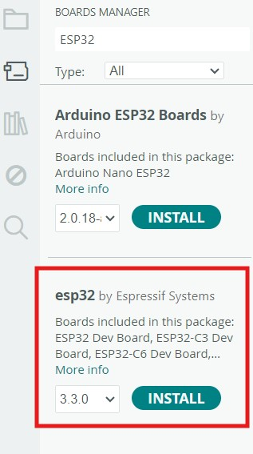
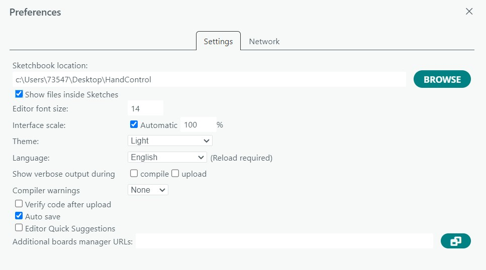

# Hand Control Software

### Installation
1. Clone this repository.
2. Install [Arduino IDE](https://support.arduino.cc/hc/en-us/articles/360019833020-Download-and-install-Arduino-IDE). If your Arduino IDE hangs on startup process, check this [link](https://forum.arduino.cc/t/ide-hangs-on-startup-with-no-error-shown-in-logs/1200013).
3. Install the latest ESP32 Package by Espressif, i.e, the following package: 

- If you meet the error,  "Downloading packages arduino:dfu-util@0.11.0-arduino5 esp32:esp-rv32@2511 Failed to install platform: 'esp32:esp32:3.3.5'. Error: 4 DEADLINE_EXCEEDED: context deadline exceeded (Client.Timeout or context cancellation while reading body)", please first try to modify the predefined timeout parameter following this [link](https://forum.arduino.cc/t/ide-2-3-7-now-gives-error-4-deadline-exceeded/1422321)
- Users in China need further to change the source following this [link](https://docs.espressif.com/projects/arduino-esp32/en/latest/installing.html) (try both **Installing using Arduino IDE** and **Manual Installation**). 

4. To compile the libraries used by this repository, please change your sketchbook location (File->Preferences->Sketchbook location) to local path of this repository, such as:

5. Open the `.ino` file for each board and select the board type:
- For servo controlling board, select “ESP32P4 Dev Module”

- For palm board, select "Arduino ESP32 Nano"

6. Compile the `.ino` file with its dependencies by clicking  button.
